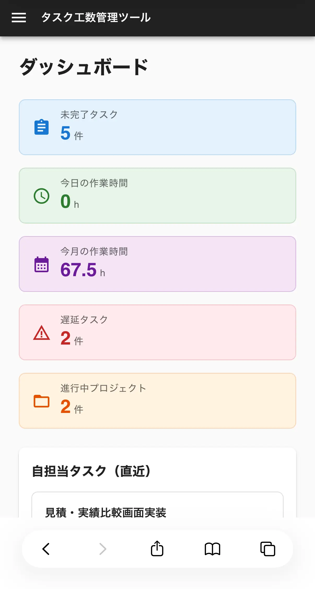
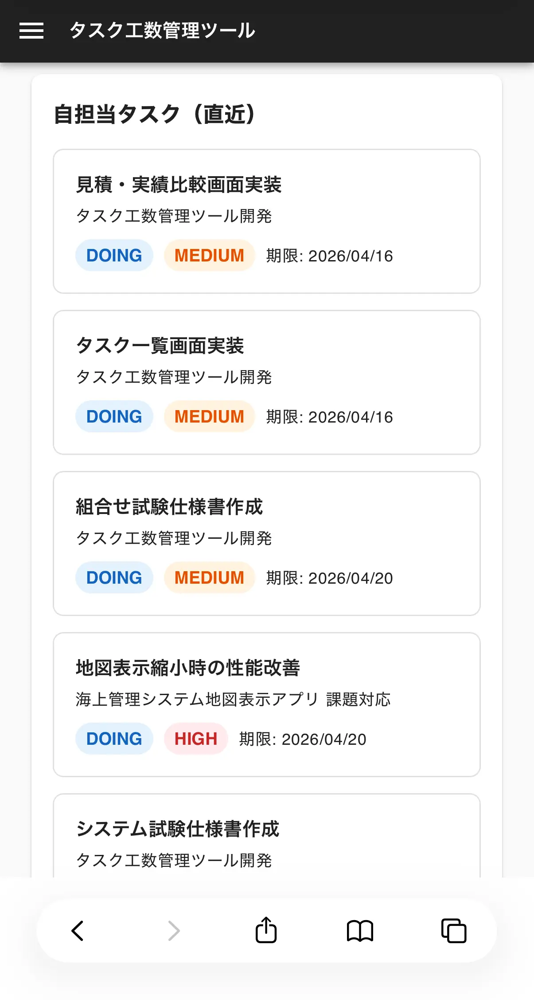
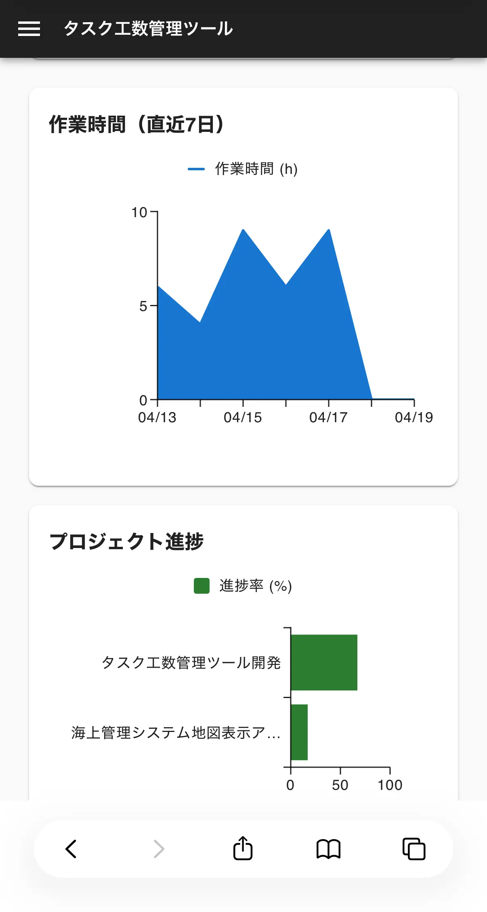

# 1. このアプリについて

## タスク＋工数管理ツール (Next.js + Spring Boot)

JWT認証を備えた、タスクと作業工数を一元管理するWebアプリです。  
プロジェクト・タスクの管理に加え、作業ログの記録・見積と実績の比較・ダッシュボードによる進捗把握ができます。

<p align="center">
  <video src="https://github.com/user-attachments/assets/0939006b-eab3-48bd-b521-76f572d88140" width="100%" controls muted>
  </video>
</p>

---

<br>

# 2. デモ

https://taskmanagementtool.kanda-software-labo.com/
<br>
(テスト用アカウント: test@example.com / stockholm1912)

---

<br>

# 3. 主な機能

- ユーザ登録・ログイン機能 (JWT認証)
- プロジェクト管理: プロジェクトの作成・一覧表示・削除
- タスク管理: タスクのCRUD・ステータス管理(TODO / DOING / DONE)・優先度(HIGH / MEDIUM / LOW)・期限・見積工数
- 担当者管理: タスクへの担当者アサイン（複数人対応）
- 工数管理: タスクに紐づく作業ログ（作業日・作業時間・メモ）の記録
- 見積 vs 実績比較: 見積工数と実績工数（作業ログの合計）の差分をタスク・プロジェクト単位で可視化
- ダッシュボード: KPIカード・直近タスク・作業時間グラフ・プロジェクト進捗グラフ
- レスポンシブデザイン対応（PC・スマホ）

## レスポンシブデザイン例 (ダッシュボード)

|                         KPIカード                          |                      自担当タスク一覧                      |                           グラフ                           |
| :--------------------------------------------------------: | :--------------------------------------------------------: | :--------------------------------------------------------: |
|  |  |  |

---

<br>

# 4. 使用方法

## ■ ログイン / アカウント登録

- アカウントを登録している場合は、ログイン画面からログインしてください。
- アカウントは、**2. デモ**に記載しているテスト用アカウントが使用可能です。
- アカウントを登録する場合は、ログイン画面のリンクからアカウント登録が可能です。

## ■ プロジェクト管理

- ログイン後はダッシュボードが表示されます。
- サイドバーの「プロジェクト一覧」からプロジェクト一覧画面に遷移できます。
- 「プロジェクト作成」ボタンからプロジェクトを新規作成できます。
- プロジェクトカードの「⋮」メニューからプロジェクトの削除が可能です。

## ■ タスク管理

- プロジェクトカードをクリックすると、そのプロジェクトのタスク一覧画面に遷移します。
- タスク一覧は担当者・ステータス・優先度・期限でフィルタリングが可能です。
- タスク一覧はタスク名・プロジェクト名・担当者・ステータス・優先度・期限・見積時間・更新日時でソートが可能です。
- 「タスク作成」ボタンからタスクを新規作成できます。
- タスク行の「⋮」メニューからタスクの削除が可能です。
- ステータス・優先度のバッジをクリックすると、インライン編集が可能です。

## ■ 作業ログ登録

- タスク行をクリックするとタスク詳細画面に遷移します。
- 「実績を登録」ボタンから作業日・作業時間・メモを記録できます。
- 担当者を表示している箇所をクリックすると、担当者のインライン編集が可能です。

## ■ 見積・実績比較

- タスク一覧画面の「見積・実績比較」タブから、プロジェクト単位・タスク単位の見積と実績の比較ができます。

## ■ ダッシュボード

- サイドバーの「ダッシュボード」から、未完了タスク数・作業時間・遅延タスク数などのKPIと、直近のタスクの一覧や直近の作業時間などのグラフを確認できます。

## ■ ログアウト

- サイドバーの「ログアウト」からログアウトができます。

---

<br>

# 5. 使用技術 / Tech Stack

- **フロントエンド**: Next.js (React, App Router), TypeScript
- **スタイリング/UI**: MUI (Material UI) v9
- **バックエンド**: Java / Spring Boot 3
- **DB**: PostgreSQL (NEON)
- **ORM**: Spring Data JPA
- **認証**: JWT (JJWT)
- **デプロイ**: Vercel (フロントエンド) / Render (バックエンド) / Neon (DB)
- **AI**: Claude Code

---

<br>

# 6. 設計のポイント

- App Routerを活用したページ構成とカスタムフック（useTasks / useProjects 等）によるデータ取得の分離
- JWTのペイロードにuserIdを格納し、バックエンドで `@AuthenticationPrincipal` を用いてリクエストユーザを特定する設計
- work_logsで工数を管理し、tasksには実績工数を持たせない正規化設計（集計はDB/Service層で実施）
- タスクの中間テーブル（task_assignments）によるN対Nのユーザアサイン管理
- TypeScriptによる厳密な型定義
- レスポンシブデザインに対応（PC: 常時表示サイドバー / スマホ: ハンバーガーメニュー）

---

<br>

# 7. ディレクトリ構造

```
taskAndManHourManagementTool/
├── backend/
│   └── task-management/          # Spring Boot プロジェクト
│       └── src/main/java/com/example/taskmanagement/
│           ├── config/           # SecurityConfig (CORS・JWT設定)
│           ├── controller/       # REST APIコントローラ
│           ├── dto/              # リクエスト・レスポンスDTO
│           ├── entity/           # JPAエンティティ
│           ├── repository/       # Spring Data JPA リポジトリ
│           ├── security/         # JWT認証フィルタ・UserDetails実装
│           └── service/          # ビジネスロジック
└── frontend/                     # Next.js プロジェクト
    └── src/
        ├── app/                  # App Router ページ
        │   ├── dashboard/        # ダッシュボード
        │   ├── projects/         # プロジェクト一覧・タスク一覧・タスク詳細
        │   ├── tasks/my/         # 自担当タスク一覧
        │   ├── register/         # ユーザ登録
        │   └── page.tsx          # ログイン画面
        ├── components/           # 共通コンポーネント・モーダル
        ├── contexts/             # 認証状態グローバル管理 (AuthContext)
        ├── hooks/                # カスタムフック
        ├── lib/                  # axiosインスタンス・スタイル定数
        └── types/                # TypeScript型定義
```

---

<br>

# 8. その他

### バックエンドの初回レスポンスについて

- バックエンドはRenderの無料プランで稼働しています。
- 15分以上アクセスがない場合、サービスがスリープ状態になります。
- スリープ後の初回アクセスは、起動完了まで**数分程度**かかることがあります。
